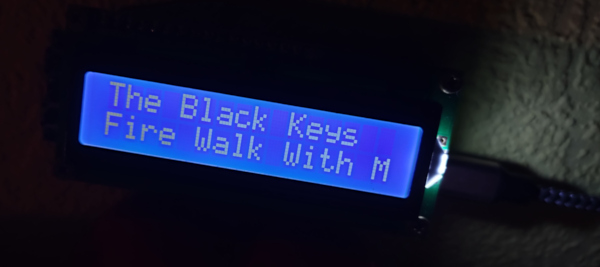
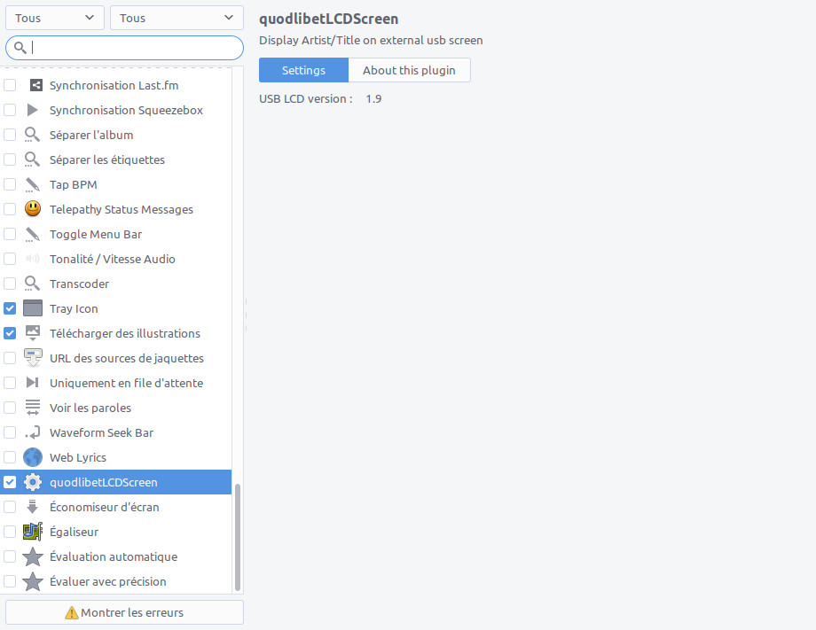
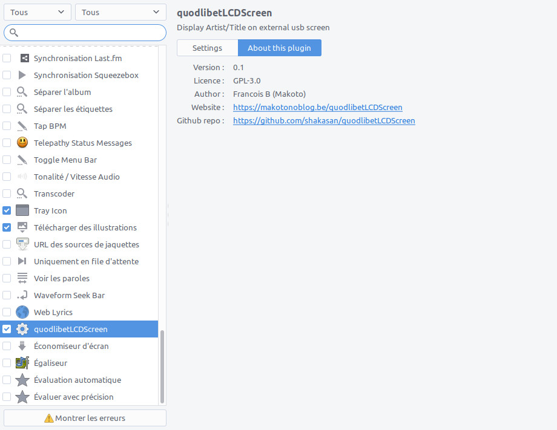

quodlibetLCDScreen
------------------

This is a little plugin for Quod Libet audio player that allow you to display current song Artist/Title on an external USB LCD Screen.



Hardware compatibility
----------------------

I used this screen :  https://www.banggood.com/1602-RGB-LCD-Display-With-USB-Port-For-Raspberry-Pi-3B-2B-B-Windows-Linux-p-1079617.html

Dependencies
------------

- lcd2usb : https://github.com/xyb/lcd2usb
- quodlibet libs
- getpass
- GTK libs

Manual install
--------------

On Ubuntu :

- Create a directory named `quodlibetLCDScreen` in `~/.quodlibet/plugins`
- Copy `quodlibetLCDScreen.py` in this directory
- Open Quodlibet and activate the plugin, you should see a `Hello <your_username>` on the screen

Udev rules
----------

- On Ubuntu, add this rules in `/etc/udev/rules.d/51-lcd2usb.rules`

```shell scriptll
# Find your device information with command "lsusb"
# Change ATTR{idVendor} and ATTR{idProduct} to match.
#
# In my case : Bus 006 Device 002: ID 0403:c630 Future Technology Devices International, Ltd lcd2usb interface
#
# This allows users to access the usb device without requiring root permissions
#
SUBSYSTEM=="usb", ENV{DEVTYPE}=="usb_device", ATTR{idVendor}=="0403", ATTR{idProduct}=="c630", MODE="0666"
```

- Then reboot computer or refresh udev : `sudo udevadm control --reload-rules`

Screenshots
-----------





Credits
-------

This script has been written by Francois B. (Makotosan)

* Email : francois@makotonoblog.be
* Website : https://makotonoblog.be/quodlibetlcdscreen

Licence
-------

The script/plugin is licensed under the terms of the GPLv3
